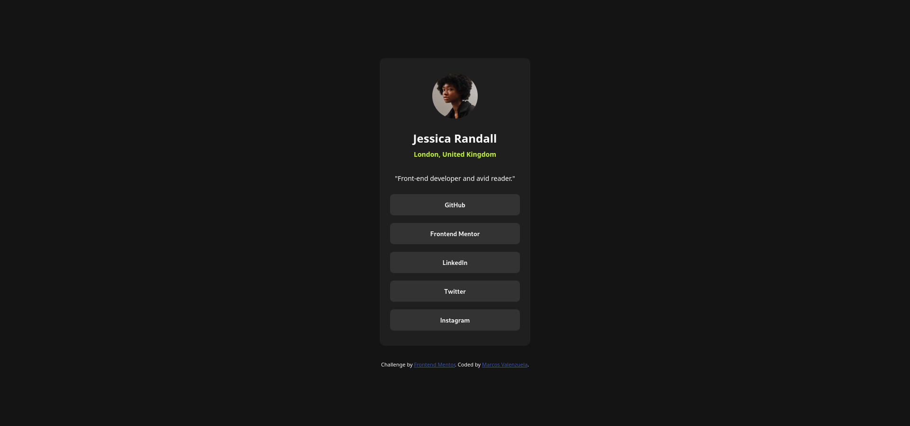
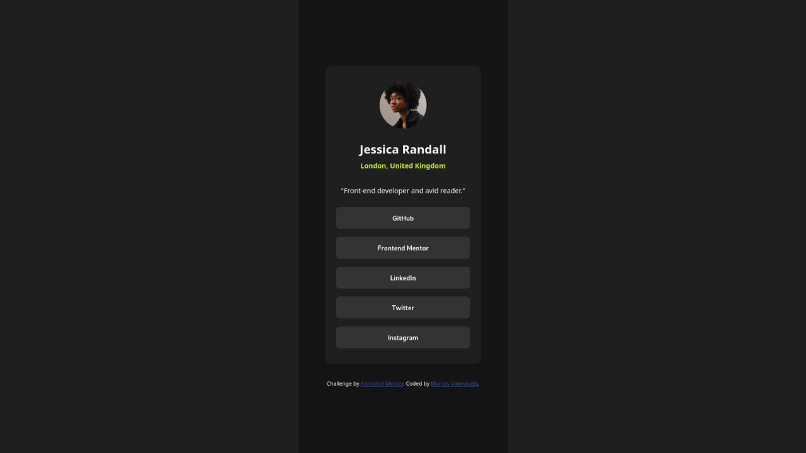

# Frontend Mentor - Social links profile solution

This is a solution to the [Social links profile challenge on Frontend Mentor](https://www.frontendmentor.io/challenges/social-links-profile-UG32l9m6dQ). Frontend Mentor challenges help you improve your coding skills by building realistic projects. 

## Table of contents

- [Overview](#overview)
  - [The challenge](#the-challenge)
  - [Screenshot](#screenshot)
  - [Links](#links)
- [My process](#my-process)
  - [Built with](#built-with)
- [Author](#author)

**Note: Delete this note and update the table of contents based on what sections you keep.**

## Overview

### The challenge

In this challenge I didn't have a figma file, so it's all done by eye with margins and paddings as well as centered blocks, I feel it's not the best organized, but it's functional.

### Screenshot

### Links

- Solution URL: [Social-links-profile using semantic HTML and CSS (no figma)](https://www.frontendmentor.io/solutions/social-links-profile-using-semantic-html-and-css-no-figma-RA04IqNr24)
- Live Site URL: [Social-links-profile](https://marcosavg.github.io/Social-links-profile/)

## My process

### Built with

- Semantic HTML5 markup
- CSS custom properties
- Mobile-first workflow

## Author

- GitHub - [MarcosAvg](https://github.com/MarcosAvg)
- Frontend Mentor - [@MarcosAvg](https://www.frontendmentor.io/profile/MarcosAvg)